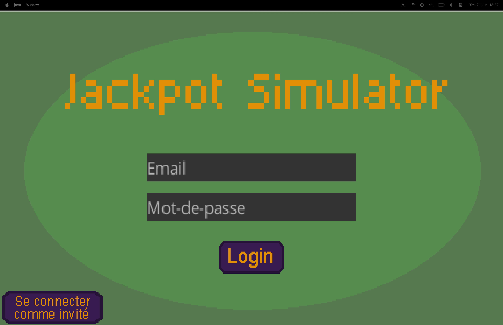
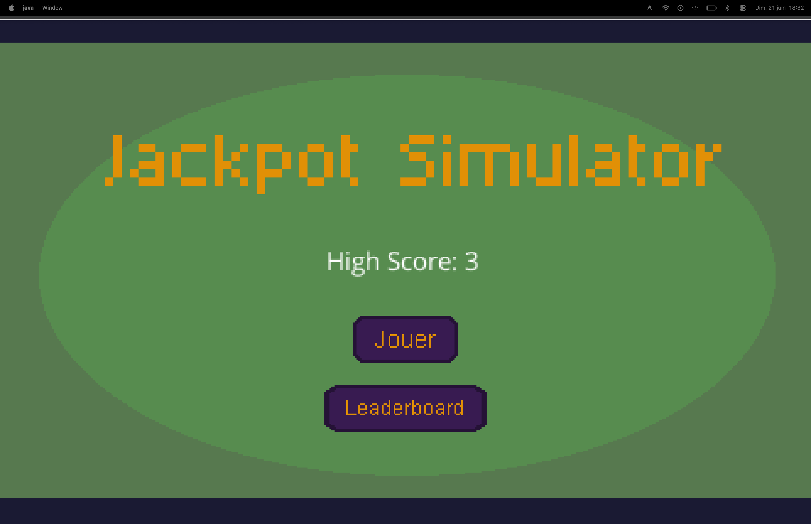
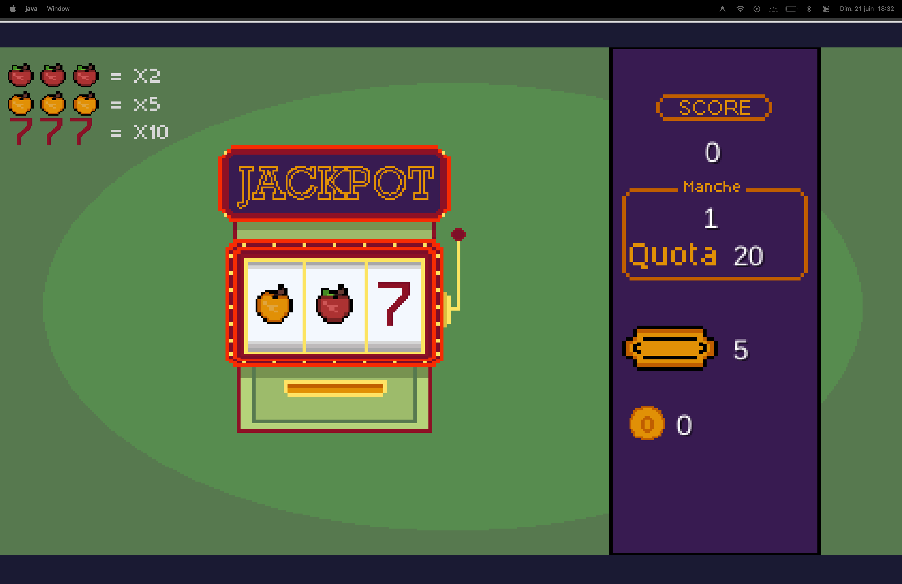
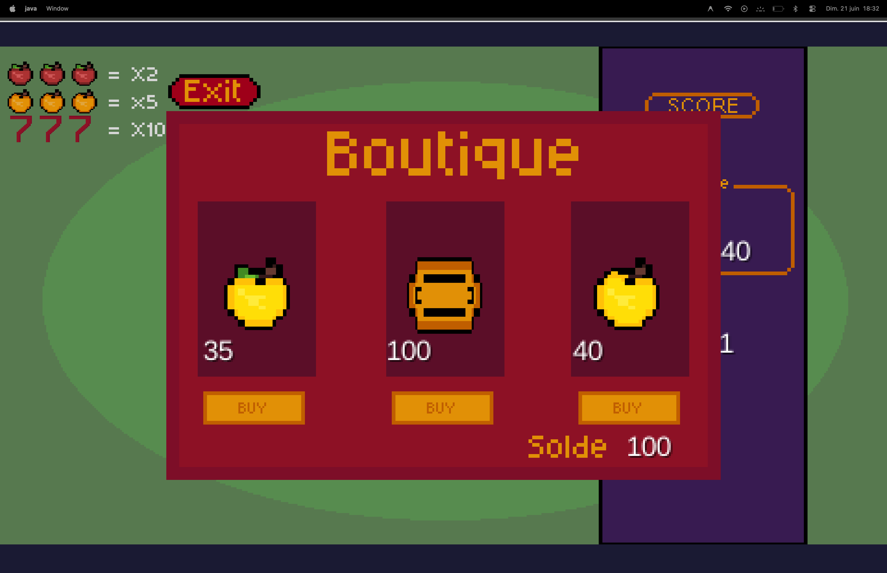
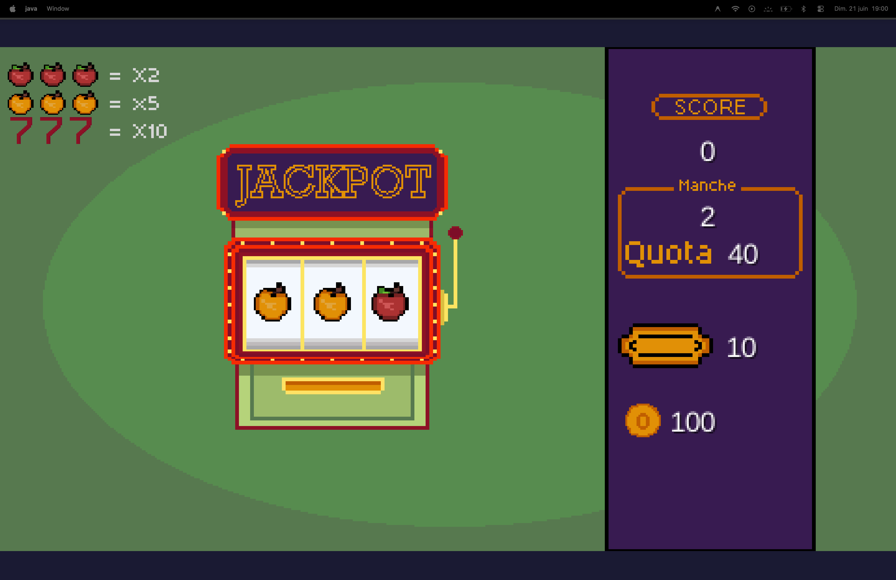
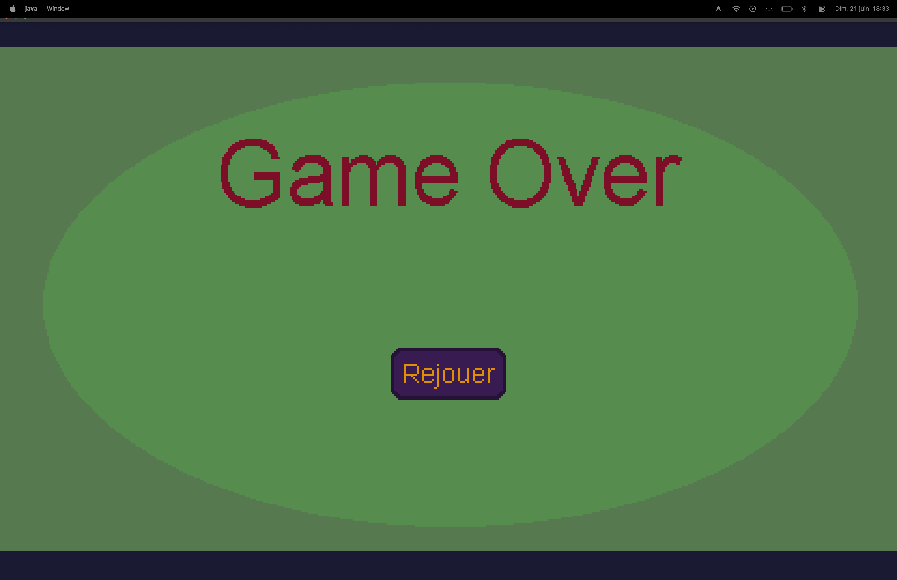

# Jackpot Simulator

Welcome to the repository for **Jackpot Simulator**, my end-of-year project.
It is a game developed in Java using the [LibGDX](https://libgdx.com/) engine.
I also integrated a database with **Supabase** to manage player logins and save high scores online.

## How to play? (Download)

Go to the **Releases** tab on GitHub and download the version that corresponds to your computer:

- **Windows**: Download the `.zip` file, extract it, and run the `.exe` inside.
- **Mac**: Download the `.dmg` file and open it.
- **Universal**: Download the `.jar` file and double-click on it (requires Java to be installed on your machine).

(The releases seems to be broken, use the .jar for now if you don't want to lose your time)
---

## How to play? (The game)

Now that you have the game on your pc/mac/toaster you can now run it.



If you are :

- **`Yoan`** : use **yoan@test.fr** and 1234 to connect.

- **`Maxime`** : use **max@test.fr** and 1234 to connect.

- **`Adrien`** : use **adrien@test.fr** and 1234 to connect.

- **`Laurent`** : use **laurent@test.fr** and 1234 to connect.

And if you are somebody else I didn't think about, I'm sorry you can open a Ticket on Jira and use "Se connecter comme invité" for now.



Ok ! Now that you're authenticated you can now access to the first screen, there you can choose to play (do it please)



You can now play, the rules are simple, you have a quota, 5 tickets at the beginning and a score, when you'll trigger the lever it will change the symbols and give you a score, for now you can hit the quota pretty simply.

When you'll reach the quota you'll see that a shop is now appearing on screen, let's move on to that.



Amazing ! You can buy what you want because you have enough money, great !

Now you can buy what you want from the store, let's imagine we buy an apple (the first on the left, the other one is an orange, yes it is), it will increase by the number of chance you'll have to get an apple, isn't it great to gamble ?

But if you're eyes are more likely to go on what's expensive, you'll find the tickets in the middle, it will increase the tickets you'll have by 5 ! So you'll have 5 more times to try to reach the quota and do a good score, let's buy it.



You can now see that we have 10 tickets instead of 5 ! (yes there is a continuity error, find it)

But what if I don't win ?



You lose. 

Impressive right ? And if you're authenticated you're score will be stored (if it's not already under you're high score)

## Project Architecture

For this project, I structured my code to ensure good maintainability and a clear separation of responsibilities:

- **`screens`**: Contains all my graphical interfaces (menus, game screen, Game Over screen...). The display is separated from the logic. I also added an `ErrorScreen` to cleanly display errors returned by the database to the user.
- **`game`**: This is where the game mechanics are coded, such as probabilities, checking game conditions, and player money.
- **`network`**: I created the `SupabaseServices` class here. It serves as a bridge to the database. All API calls and JSON response processing are done here, to avoid polluting the graphical interface.

> *Security Note: Since the game is a local application (thick client) communicating directly with Supabase, the API key present in the code is the public "publishable" key. Unfortunately, I did not have the time to create a shield API, so I set up RLS to provide some security.*

## Automated Tests

I set up unit tests with **JUnit 5** to ensure that the core of the game works well (for example, verifying that the player's money is properly debited when they buy something).

To run the tests from the source code:
```bash
./gradlew test
```

## For graders / developers

If you wish to recompile or run the project from the source code:
1. Clone this repository.
2. Open a terminal in the project folder.
3. Run the game with the following command:

On Mac / Linux: `./gradlew lwjgl3:run`
On Windows: `gradlew.bat lwjgl3:run`
